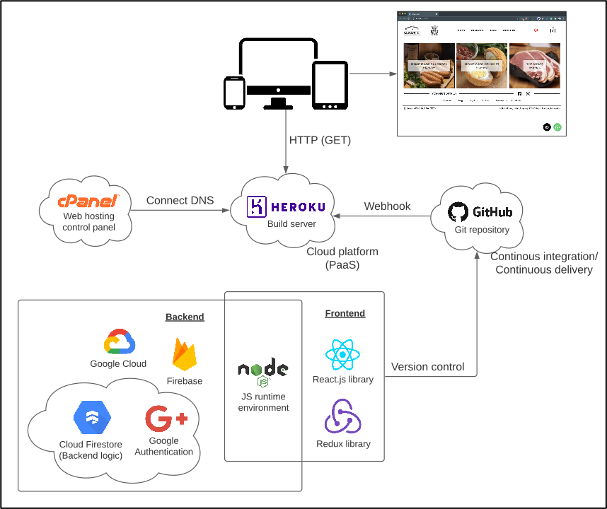

<h1>
  <a href="http://www.new.sausagekl.com/">
    E-commerce | React Redux Firestore
  </a>
</h1>

This site was developed by [YeeHan Chung](https://yeehan.me) for the completion of his final year project (employer project) from **August 17, 2020** to **November 26, 2020**. This project was bootstrapped with [Create React App](https://github.com/facebook/create-react-app).

## Lessons learnt 📚 🧩

- Stop worrying, start doing.
- Be careful of [**Spaghetti Codes**](https://en.wikipedia.org/wiki/Spaghetti_code).
- Importance of refactoring.
- Google to find solutions efficiently.
- Realized how various technologies work together.
- Understood how technologies work **under the hood**.
  - `react.js`, `redux`, `firebase`, `styled-components`
- Found that **full-stack/front-end development** is my **cup of tea** ❤️

## Architecture diagram (Initially)

